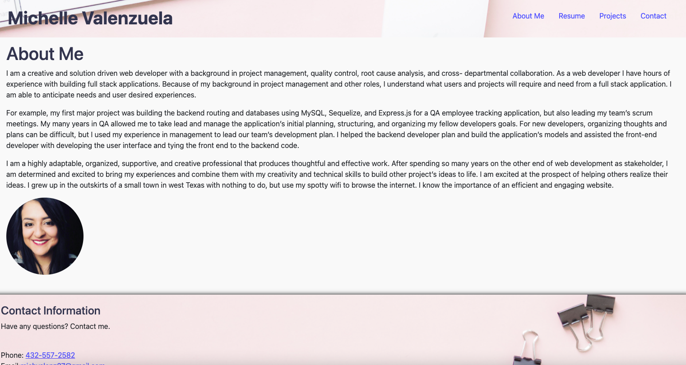

   

   

  # Portfolio

  ## Description 
  My portfolio highlights my work and experiences, while at the same time telling you a little about myself.

  

  ## Table of Contents

  * [Installation](#Installation)
  * [Usage](#Usage)
  * [Contributions](#Contributions)
  * [Testing](#Testing)
  * [License](#License)
  * [Questions](#Questions)

  ## Installation
  Click on deployed page.

  ## Usage
  To review my experiences and work as a web developer.

  ## Contributions
  No contributions.

  ## Testing 
  No tests needed.

  ## License 
  This project has an MIT license.
  https://opensource.org/licenses/MIT

 
  

  ## Questions
  Need to reach me?
  * Email: michvalenz27@gmail.com
  * [GitHub](https://github.com/MichValenz/portfolio)

       
       